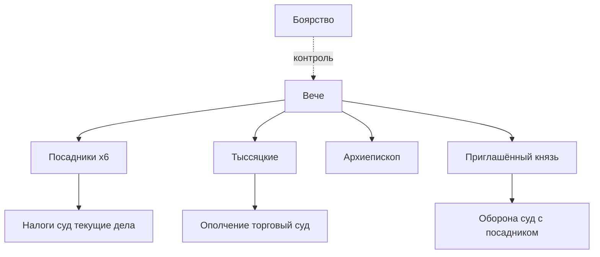

#Разработка #Сеттинг #Политика

[[00 — Обзор]] · [[03 — Сословия и общество]] · [[10 — Право и суд]] · [[Источники и литература]]

---

## Общая схема власти

Новгородская республика — **не демократия в современном смысле**. Вече формально верховно, но с XIV в. **бояре** доминируют в выборах и решениях. Исследователи (Valentin Yanin, Vladimir Petrukhin и др.) описывают вече как «народное собрание» при фактическом **олигархическом** управлении.

> «И бояре, и житьи люди, и купцы, и черные люди, и весь господин государь Великий Новгород, все пять концов…» — формула полномочного вече (цитируется по [web.snauka.ru](https://web.snauka.ru/issues/2015/05/53547)).

---

## Вече

| Аспект      | Содержание                                                                                                                                                     |
| ----------- | -------------------------------------------------------------------------------------------------------------------------------------------------------------- |
| Суть        | Общегородское (и иногда общеземское) собрание свободных общинников                                                                                             |
| Созыв       | Звон **вечевого колокола**; места — [[08 — Город и архитектура#Ярославово дворище\|Ярославово дворище]], иногда площадь у Софийского собора («владычное вече») |
| Полномочия  | Выбор посадника, тыссяцкого, архиепископа; приглашение/изгнание князя; война и мир; крупные налоги                                                             |
| Ограничения | Решения готовятся элитой; «народ» часто подтверждает уже согласованное                                                                                         |

**Вечевой колокол** — символ независимости (с кон. XIV — нач. XV в.). В 1478 г. Иван III вывез его в Москву.

См. подробнее: [[02 — Вече и должности]]

---

## Посадник

Главный **городской** правитель; название от «посад» (административный центр).

| Период | Особенности |
|--------|-------------|
| До XIV в. | Один посадник, из бояр |
| **1354** | Введено **6 посадников** на пожизненный срок |
| Ежегодно | Из шести избирается **степенной** (председательствующий) посадник |
| Функции | Председательствует на вече; суд с князем; сбор налогов; дипломатия; согласование решений князя |

Для игры: должность **Посадника** — вершина политического пути ([[Первый GDD#2.5]])

**Источники:** [Novgorod Republic — Wikipedia](https://en.wikipedia.org/wiki/Novgorod_Republic); [Grokipedia: posadnik](https://grokipedia.com/page/Novgorod_Republic)

---

## Тыссяцкий

Изначально — «начальник тысячи» (ополчение). К XIV в.:

- Командование городским ополчением
- **Торговый суд**, контроль мер и весов
- Представительство **купечества** и «чёрных людей» в совете

С **1372** г. — до **6 тыссяцких** (по аналогии с посадниками), монополия боярских родов.

---

## Князь

- **Не наследный** правитель Новгорода — **наёмный** из княжеских семей (часто из [[09 — Внешняя политика|Москвы, Суздаля, Литвы]])
- Приглашается по **договорной грамоте** с ограничениями: не судит без посадника, не вмешивается в торговлю, живёт в **Детинце**
- Полномочия: военная оборона, суд (совместно с посадником), представительство в некоторых делах
- Может быть **изгнан** вечем

---

## Архиепископ

- С **1165** г. — архиеpiscopal кафедра (до того — епископ)
- Избирается вечем, утверждается митрополитом
- Крупнейший землевладелец; собственный суд (**владычный**)
- Влияние на внешнюю политику и культуру

См. [[07 — Церковь и религия]]

---

## Боярские «группировки»

Боярство организовано по **концам** и **родам**. Соперничество родов (напр. открытые конфликты в XV в.) — основа городских **феудов** и заговоров.

Для игры: коалиции на вече, браки, месть — ядро политического геймплея ([[Система слухов]], [[Карта актёра (Персонажа)]])

---

## Связанные темы

- [[04 — Территория и администрация]] — концы и пятины
- [[11 — Хронология событий]] — реформы 1354, 1372
- [[09 — Внешняя политика]] — падение республики 1471–1478
