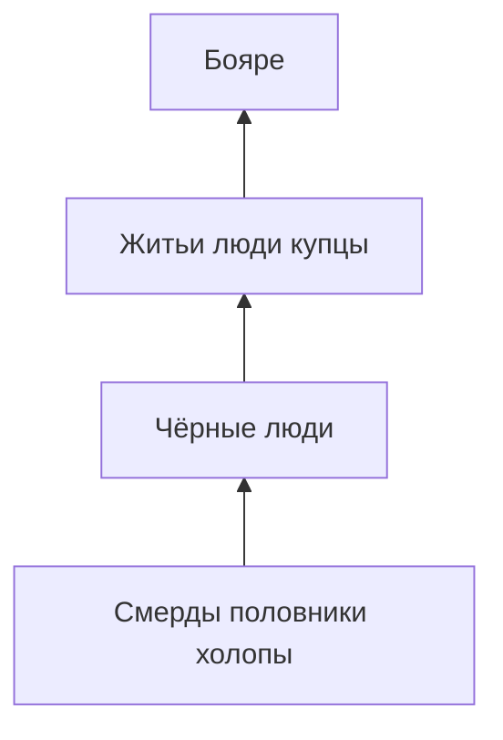

#Разработка #Сеттинг #Общество

[[00 — Обзор]] · [[Сословия ранги и функции/00 — Обзор|Сословия, ранги и функции (подробно)]] · [[05 — Экономика и торговля]] · [[Первый GDD#2.3]] · [[Источники и литература]]

---

## Сословная пирамида (XIV–XV в.)

Формула вече перечисляет: **бояре → житьи люди → купцы → чёрные люди → все пять концов**.

---

## Бояре

| | |
|---|---|
| **Статус** | Высшая знать, крупные землевладельцы |
| **Владения** | Городские дворы + вотчины в пятинах |
| **Власть** | Монополия на посадничество и тыссяцкую (XIV–XV) |
| **XV в.** | >90% «ядра» новгородской земли — у бояр, житьих людей и церкви ([Springer: Why Did Lord Novgorod Fall](https://link.springer.com/article/10.1134/S1019331622110090)) |

Для игры: **боярин** — верх social ladder; браки, взятки, коалиции.

---

## Житьи люди

- Средний слой: **зажиточные** горожане и мелкие/feodal средние землевладельцы
- С XIV в. — преемники «**вящих**» (лучших) купцов ([Житьи люди — Wikipedia](https://ru.wikipedia.org/wiki/Житьи_люди))
- Участвуют в **торговле**, **дипломатии**, **суде** от концов
- Имеют **земли** (иногда обширные — свидетельство гостя Ланнуа, см. Ключевского)
- После 1478 многие переселены московитами с **поместьями** — признак военно-служилого статуса, не чистого купечества

Для игры: происхождение **«Труженик/Купец»**, путь через ремесло и контракты.

---

## Купцы

- Пересекаются с житьими людьми; выделяются **торговой** деятельностью
- Организованы в **сторы** (корпорации): крупнейшая — **Ивановское сто** при ц. Иоанна Предтечи на Опоках ([Рыбина](http://www.plam.ru/hist/ocherki_istorii_srednevekovogo_novgoroda/p27.php))
- Торговый суд, эталоны мер, хранение грамот

См. [[06 — Ганза и иностранные дворы]]

---

## Чёрные люди

| Где | Кто |
|-----|-----|
| Город | Ремесленники: плотники, гончары, кузнецы, портные, кожевники… |
| Село | Свободные общинники на «чёрных» (общественных) землях |

«Чёрные» — не этнический термин, а **социальный** (младшие, «задние» vs «передние» бояре).

Для игры: старт **смерда/ремесленника** ([[Первый GDD#2.3]])

---

## Сельское население

| Категория | Описание |
|-----------|----------|
| **Земцы (своеземцы)** | Свободные общинники на своей земле |
| **Смерды** | Работают на **государственных** (новгородских) землях |
| **Половники** | Аренда частной земли «**испол**» — половина урожая хозяину |
| **Холопы** | Зависимые; служба в доме, работа в вотчине |

---

## Зависимые и «низ»

- **Закладники** — смерды, вышедшие из общины под опеку феодала
- **Работа** на боярских дворах и в мастерских
- Социальная мобильность **возможна**, но через богатство, брак, службу или церковь

---

## Связь с игровыми стадиями

| Стадия GDD | Исторический прототип |
|------------|----------------------|
| Смерд | Смерд, чёрный ремесленник, мелкий торговец |
| Купец/ремесленник | Житой человек, член ста |
| Боярин/посадник | Боярский род, степенной посадник |

---

## Источники

- [history.wikireading.ru — глава V](https://history.wikireading.ru/202788)
- [Ключевский, лекция XXIV](https://statehistory.ru/books/Vasiliy-Klyuchevskiy_Kurs-russkoy-istorii/24)
- [Житьи люди — Wikipedia](https://ru.wikipedia.org/wiki/Житьи_люди)
