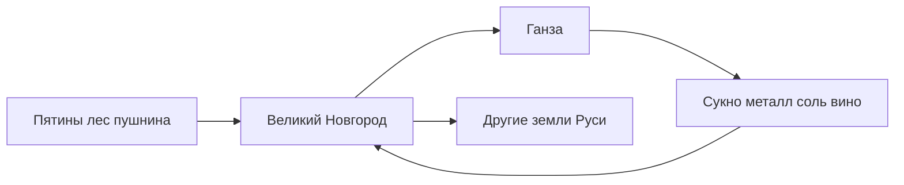

#Разработка #Сеттинг #Экономика

[[00 — Обзор]] · [[06 — Ганза и иностранные дворы]] · [[Экономика — количественная спецификация]] · [[Источники и литература]]

---

## Экономика XIV–XV в. (обзор)

Новгород — **транзитный хаб** между лесной Русью и **Бaltic/Hanse** Europe.

---

## Экспорт

| Товар          | Источник                  | Значение                                  |
| -------------- | ------------------------- | ----------------------------------------- |
| **Пушнина**    | Пятины, Уral, Pomor       | Главная статья; куница, соболь, горностай |
| **Воск**       | Крестьянское бортничество | Свечи для Европы; рост экспорта в XIV–XV  |
| **Мёд**        | Лесные пасеки             | Пища, медовуха, экспорт                   |
| **Кожа, соль** | Промыслы                  | Вторичные статьи                          |
| **Лён, рыба**  | Село, озёра               | Внутренний и внешний оборот               |

> «Пушнина и воск — главные товары… в обмен на сукно, металлы, серебро, соль» — [wikireading: таможенная история](https://law.wikireading.ru/5062)

---

## Импорт

- **Сукно** (Flemish, English)
- **Металлы**, серебро (монеты, украшения)
- **Соль** (особенно до освоения местных залежей)
- **Вино**, пряности
- **Оружие**, доспехи (ограниченно)

---

## Ремесло и производство

| Отрасль | Продукты |
|---------|----------|
| Дерево | Суда ([[Экономика — количественная спецификация#8|ладьи]]), бочки, строительство |
| Кожа | Обувь, ремни, книжные переплёты |
| Металл | Ножи, замки, украшения |
| Ткачество | Холст, верёвки |
| Пища | Хлеб, рыба, соленья |

**Ивановское сто** — купеческая корпорация с судом и мерами ([Рыбина](http://www.plam.ru/hist/ocherki_istorii_srednevekovogo_novgoroda/p27.php)).

---

## Деньги и меры

- **Серебро**: новгородские и иностранные монеты в обращении
- Меры хранились на **Опоках** (у Ивановского ста)
- Штрафы и пошлины — в **гривнах** и **денгах** (см. игровую [[Экономика — количественная спецификация#1.1]])

---

## Налоги и пошлины

- **Таможня** на иностранных дворах
- Сбор с **караванов** и речного транспорта
- Княжеские **кормления** — часть дани уходит приглашённому князю (ограничено договором)
- Подати с пятин — на вече и посадника

---

## Конкуренция

- **NPC-купцы** (исторически — другие станы и боярские караваны)
- Сезонность: **зимние** и **летние** торговые поездки ганzeйцев
- Кризисы: блокада путей (войны со Швецией XIII–XIV), неурожай

---

## Связь с игрой

Игровая экономика v0.1: [[Экономика — количественная спецификация]]  
Исторические товары → будущие производственные цепочки (мех → шуба, воск → свечи, лён → холст).

---

## Источники

- [История внешней торговли Новгорода — Wikipedia](https://ru.wikipedia.org/wiki/История_внешней_торговли_Великого_Новгорода)
- [law.wikireading.ru — XIV–XV вв.](https://law.wikireading.ru/5062)
- [adm.nov.ru — ганзейский город](http://www.adm.nov.ru/page?docid=704)
