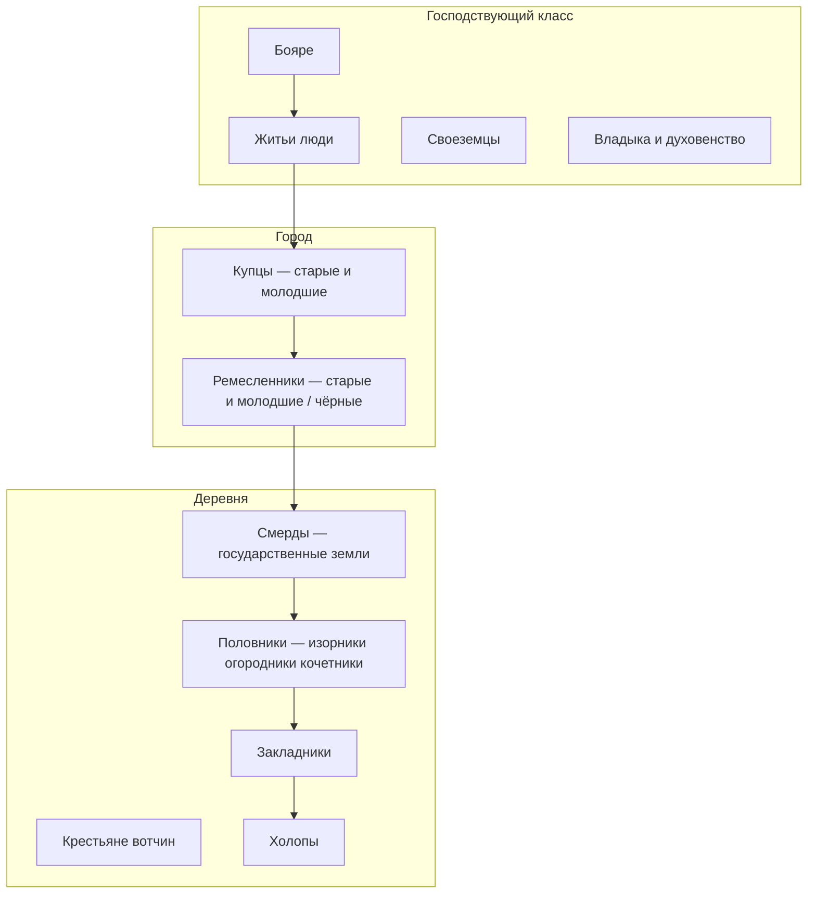

#Разработка #Сеттинг #Общество

[[00 — Обзор]] · [[02 — Ранги и звания]] · [[03 — Должности и полномочия]]

---

## Общая схема

Новгородское общество — **не замкнутые касты**, а переплетённые слои: бояре и купцы владеют землёй и торгуют; церковь — крупнейший землевладелец; город платит повинности, деревня — ренту.

---

## 1. Господствующий класс (феодалы)

### Бояре

| | |
|---|---|
| **Статус** | Крупные землевладельцы, верхушка республики |
| **Жизнь** | Городские усадьбы; на дворах — зависимые ремесленники, мелкие торговцы, челядь |
| **Доходы** | Оброк с вотчин, торговля, ростовщичество, поборы с колоний на севере |
| **Власть** | Монополия на посадничество и тысяцкую; ядро боярского совета |

С 1136 г. бояре **захватили власть** после изгнания князя; княжеского домена в Новгородской земле не сложилось.

### Житьи люди

- **Средние феодалы** — по статусу ниже бояр, но тоже торгуют и владеют землёй
- Участвуют в **торговом суде** (в т.ч. «Иванского ста»)
- Для игры: **мост** между купечеством и боярством

### Своеземцы

- **Мелкие землевладельцы** с небольшими участками
- Обрабатывают землю **своим трудом**
- Ближе к крестьянству, чем к боярской верхушке

### Церковь и монастыри

| Субъект | Роль |
|---------|------|
| **Владыка** (архиепископ Софийского собора) | Избирается на вече из настоятелей влиятельных монастырей |
| **Высшее духовенство, монастыри, церкви** | Крупные земельные собственники |
| **Десятина** | Доля от торговых пошлин и судебных штрафов (вир, продаж) |
| **Торговля** | Собственные лавки; церковь — покровитель торговли |

Бояре и купцы **«ставили»** церкви, встраивая в них кладовые; монастыри владели пригородными угодьями и вели торговлю.

---

## 2. Городское население

### Купцы

| Признак | Детали |
|---------|--------|
| Организация | Корпорации — **«сотни»** и **«ста»** (аналог западноевропейских гильдий) |
| Крупнейшая | **Иванское сто** при ц. Иоанна Предтечи на Опоках |
| Суд | Купеческий суд; эталоны мер («локоть иванский», «гривенка рублевая», вощаные весы) |
| Статус | Богатые купцы имеют земли и **примыкают к аристократии** |

Деление: **«старейшие»** и **«молодшие»** (или **«чёрные»** в широком городском смысле) — по имуществу и стажу в корпорации.

### Ремесленники

| Признак | Детали |
|---------|--------|
| Организация | **Слободы** и **сотни** (слабее организованы, чем купеческие) |
| Повинности | Строительство и ремонт укреплений, дорог, городских построек |
| Льготы | Состоятельные ремесленники и богатые купцы **освобождены** от государственных повинностей |

---

## 3. Сельское население

### Две большие группы

| Группа                | Кому подчиняются                       | Название                  |
| --------------------- | -------------------------------------- | ------------------------- |
| Государственные земли | Органам «Господина Великого Новгорода» | **Смерды**                |
| Частные вотчины       | Отдельным землевладельцам              | Крестьяне-половники и др. |

Смерды живут **общинами** и подчиняются государственной администрации.

### Типы крестьян по ренте и занятиям

| Тип | Занятие | Рента / условие |
|-----|---------|-----------------|
| **Изорники** | Пашенное хозяйство | Половина урожая за землю |
| **Огородники** | Огород во временном владении | Оброк |
| **Кочетники** | Рыболовство на чужих угодьях | Половина улова |
| **Закладники** | Разорившиеся крестьяне | Кабала к феодалу; наиболее бесправные |
| **Холопы** | Домашнее хозяйство, вотчина | Рабский статус |

**Половники** — общее имя для тех, кто отдаёт **половину дохода**; не полностью крепостные, но переход к другому господину ограничен сроком (см. Псковскую судную грамоту, ст. 42 — отказ в «Филиппово заговенье»).

---

## 4. Имущественная дифференциация

- В городе разрыв между **богатыми** (освобождёнными от повинностей) и **основной массой** (подать, трудовые повинности) — **очень резкий**
- Боярство связано с торговлей сильнее, чем в других русских землях — из-за торговых путей Балтика ↔ Восток
- Колониальные владения на севере дают **дань** (меха, лён, медь) — дополнительный источник богатства элиты

---

## Для игры

| Слой                           | Игровая роль                                     |
| ------------------------------ | ------------------------------------------------ |
| Бояре                          | Финальный ранг; коалиции, вече, война            |
| Житьи / богатые купцы          | Торговля, суды, выход на вече                    |
| Ремесленники / [[Чёрные люди]] | Крафт, повинности, локальные слободы             |
| Смерды / половники             | Стартовый путь; налоги, бунты, побег             |
| Закладники / холопы            | Кризисные события, долговые механики             |
| Церковь                        | Параллельная ветка власти, грамотность, десятина |

См. [[06 — Для игры — социальная лестница]]
