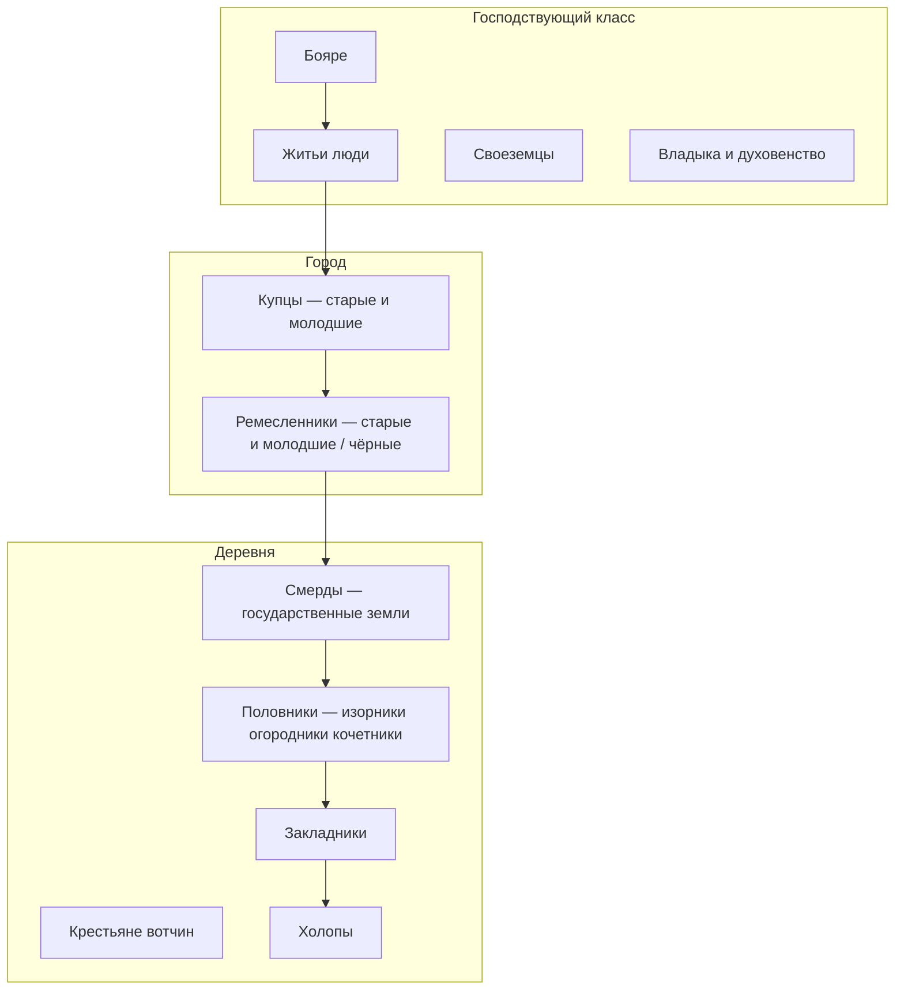

#Разработка #Сеттинг #Общество

[[00 — Обзор]] · [[02 — Ранги и звания]] · [[03 — Должности и полномочия]]

---

## Общая схема

Новгородское общество — **не замкнутые касты**, а переплетённые слои: бояре и купцы владеют землёй и торгуют; церковь — крупнейший землевладелец; город платит повинности, деревня — ренту.

---

## 1. Церковь и монастыри

| Субъект                                     | Роль                                                     |
| ------------------------------------------- | -------------------------------------------------------- |
| **Владыка** (архиепископ Софийского собора) | Избирается на вече из настоятелей влиятельных монастырей |
| **Высшее духовенство, монастыри, церкви**   | Крупные земельные собственники                           |
| **Десятина**                                | Доля от торговых пошлин и судебных штрафов (вир, продаж) |
| **Торговля**                                | Собственные лавки; церковь — покровитель торговли        |
|                                          |                                                          |

Бояре и купцы **«ставили»** церкви, встраивая в них кладовые; монастыри владели пригородными угодьями и вели торговлю.

---

## 2. Городское население

[[Старшие купцы]]

[[Молодшие купцы]]

[[Чёрные люди]]

[[Житьи люди]]

[[Своеземцы]]

[[Бояре]]

---

## 3. Сельское население

[[Общие данные/Смерды|Смерды]]

[[Крестьяне]]

[[Холопы]]

---

## Для игры

| Слой                           | Игровая роль                                     |
| ------------------------------ | ------------------------------------------------ |
| [[Бояре]]                      | Финальный ранг; коалиции, вече, война            |
| Житьи / богатые купцы          | Торговля, суды, выход на вече                    |
| Ремесленники / [[Чёрные люди]] | Крафт, повинности, локальные слободы             |
| Смерды / половники             | Стартовый путь; налоги, бунты, побег             |
| Закладники / холопы            | Кризисные события, долговые механики             |
| Церковь                        | Параллельная ветка власти, грамотность, десятина |

См. [[06 — Для игры — социальная лестница]]
