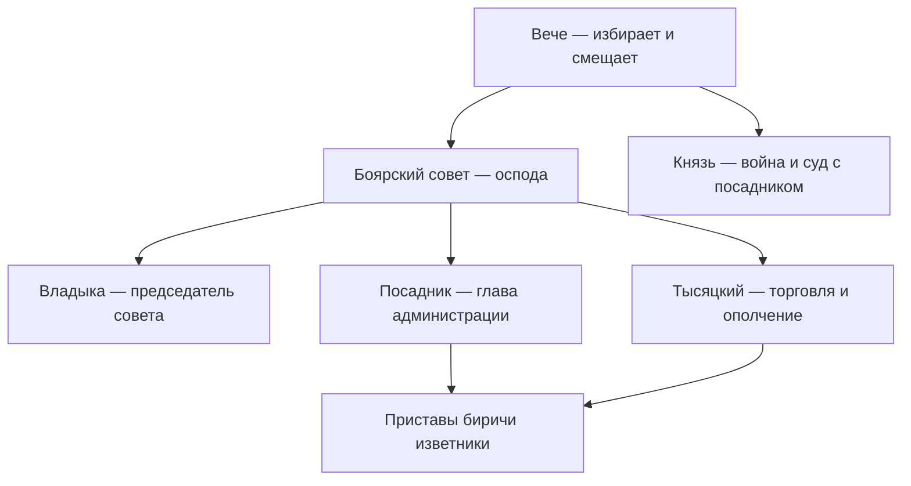

#Разработка #Сеттинг #Политика

[[02 — Ранги и звания]] · [[04 — Органы власти]] · [[02 — Вече и должности]]

---

## Иерархия должностей

---

## Посадник

**Первое** по важности должностное лицо. Избирается на вече из знатнейших бояр; фактически кандидатуру готовит «оспода».

| Сфера | Полномочия |
|-------|------------|
| Вече | Председательствует |
| Князь | Контролирует деятельность |
| Война | С князем и тысяцким — глава вооружённых сил |
| Оборона | Строительство укреплений |
| Суд | Судья; сложные дела — с княzem |
| Администрация | Управление, назначение местных чинов |
| Финансы | Взыскание податей |
| Внешняя политика | Договоры (вместе с княzem) |

**Старый посадник** — отставной, но остаётся в боярском совете.

*Для игры (XIV–XV):* с 1354 г. — несколько пожизненных посадников + ежегодный «степенной» (см. [[02 — Вече и должности]]).

---

## Тысяцкий

**Второе** по значению лицо. Также из знатных боярских родов.

| Сфера | Полномочия |
|-------|------------|
| Торговля | Организация и контроль |
| Суд | Торговые тяжбы; с старостами от купечества |
| Ополчение | Формирование городского ополчения |
| Война | Вместе с княzem и посадником — верховное командование |
| Администрация | Помощь посаднику |

Посадник и тысяцкий получают **кормление** — право сбора определённых повинностей за службу.

---

## Князь (приглашённый)

Князь **не владеет** Новгородской землёй как доменом. Приглашается после согласования на «осподе» и утверждения вечем; подписывает **договорную грамоту** (~80 договоров XIII–XV вв. известны).

### Ограничения (типовые по договорам)

| Запрет | Смысл |
|--------|-------|
| Покупать и раздавать землю | Не создать княжеский домен |
| Ставить сёла в Новгородской волости | То же |
| Судить без посадника | Разделение власти |
| Судить торговые споры бояр и купцов | Изъятие из юрисдикции |
| «Белые» слободы и сбор мыта | Монополия города на пошлины |
| Торговля с иностранцами без посредников | Защита новгородских купцов |
| Законы, война, мир по своей воли | Власть веча |
| Приём закладников | Не наращивать зависимое население |
| Жалобы горожан и холопов на «осподу» | Изоляция элиты от народа |

### Что князь делает

| Сфера | Функция |
|-------|---------|
| Война | Главная причина приглашения; своя дружина |
| Командование | С посадником и тысяцким — все силы республики |
| Суд | С посадником — сложные дела |
| Администрация | Назначение и контроль местной власти |
| Дипломатия | Договоры с иноземцами от имени Новгорода |

### Доходы князя

- «Дар» с волостей вне древних коренных владений
- Часть судебных и проезжих пошлин
- Угодья: охота, рыбная ловля, сенокос (по договору)

---

## Владыка (архиепископ)

| Сфера | Полномочия |
|-------|------------|
| Церковь | Чёрное и белое духовенство, монастыри, храмы |
| Совет | Председатель «осподы» (замена — архимандрит Юрьева) |
| Суд | Церковный суд; «совестные» дела; контроль мер и весов |
| Финансы | Десятина; хранитель **государственной казны** |
| Война | **Владычный полк** при Софийском соборе |
| Дипломатия | Представительство, печать на грамотах |

Избирается из монахов **боярского происхождения**.

---

## Местные и исполнительные должности

| Должность | Уровень | Функции |
|-----------|---------|---------|
| **Кончанский староста** | Конец (район) | Управление с коллегией знатных; кончанское вече |
| **Сотский** | Сотня / улица | Ополчение, полиция, суд |
| **Новгородский муж** | Волость | Администрация в пятине |
| **Наместник** | Крупный город (Псков до 1348) | От имени Новгорода |
| **Пристав** | Город | Судебные и административные приказы |
| **Бирить** | Город | Суд, розыски |
| **Изветник** | Город | Сообщение о преступлениях |
| **Воевода** | Война | Назначается вечем |
| **Вечевые дьяки** | Вече | Администрация веча, грамоты, печать |

---

## Вооружённые силы

| Часть | Состав |
|-------|--------|
| Княжеская дружина | Пока князей приглашают |
| Владычный полк | Постоянное войско при Софии |
| Городское ополчение | Сотни и концы; формирует тысяцкий |

---

## Для игры

| Должность | Игровой потенциал |
|-----------|-------------------|
| Посадник | Финальная цель карьеры; баланс войны и налогов |
| Тысяцкий | Торговые квесты, караваны, экономические кризисы |
| Князь | NPC-военачальник; договор с скрытыми пунктами |
| Владыка | Религиозная ветка; казна; моральный суд |
| Сотский | Локальные события на улице |
| Кончанский староста | Фракции пяти концов |

См. [[04 — Органы власти]] · [[06 — Для игры — социальная лестница]]
