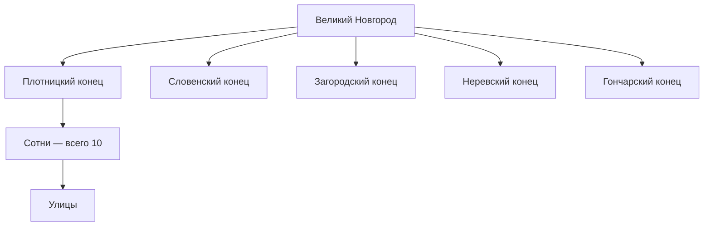

#Разработка #Сеттинг #Территория

[[04 — Органы власти]] · [[04 — Территория и администрация]] · [[08 — Город и архитектура]]

---

## Два масштаба: город и земля

Новгород — **столица** и **суверен** («Господин Великий Новгород»). Администрация города и Новгородской земли связана через **концы** и **пятины**.

---

## Администрация Великого Новгорода

### Концы (5)

Исторически сложившиеся **посады** — районы города + связанная территория:

| Конец | Примечание |
|-------|------------|
| Плотницкий | |
| Словенский | |
| Загородский | |
| Неревский | |
| Гончарский | |

### Сотни (10 в городе)

| Роль | Описание |
|------|----------|
| Административная | Деление конца |
| Военная | Призыв доли ополчения |
| Торгово-ремесленная | У купцов — корпорации («Иванское сто» и др.) |

**Сотский** — полиция, суд, благоустройство, контроль торговли на своей территории.

### Улицы

Нижний уровень городского деления; местное самоуправление и повинности.

---

## Новгородская земля

| Уровень | Единица | Управление |
|---------|---------|------------|
| 1 | **Пятина** (5) | Подчинена одному из концов Новгорода |
| 2 | **Волость** | «Новгородские мужи» |
| 3 | **Погост** | Ниже волости |

### Пятины (для справки)

- Деревская
- Обонечская
- Бежецкая
- Подинская
- Русская

*(Подробнее — [[04 — Территория и администрация]])*

### Зависимые территории

Колониальные владения на **севере и северо-востоке** (до Ледовитого океана и Урала): зависимое население платит **дань** (меха, лён, медь) — ресурс для торговли и элиты.

### Другие города

- **Псков** (до 1348) — наместник Новгорода, но своё вече и должности
- Крупные центры — **относительная самостоятельность**

---

## Самоуправление: цепочка

1. **Вече** — весь Новгород
2. **Кончанское вече** — конец
3. **Сотня / улица** — местные старосты и сотские
4. **Волость** — новгородский муж в пятине

Боярский совет вынужден **договариваться** с торгово-ремесленными кругами и концами — иначе невозможно удержать огромную землю и подавлять восстания.

---

## Повинности по территории

| Кто | Что несёт |
|-----|-----------|
| Основная масса горожан | Подать; ремонт стен, дорог, построек |
| Богатые купцы и состоятельные ремесленники | Освобождены от государственных повинностей |
| Смерды | Повинность в пользу «Господина Великого Новгорода» |
| Половники | Рента землевладельцу + общие повинности по договору |

---

## Для игры

| Единица | Использование |
|---------|---------------|
| Конец | Фракция игрока; выборы старосты; локальные кризисы |
| Сотня | Ополчение в войне; «домашний» район |
| Пятина | Карта ресурсов; дань с севера; налоги |
| Погост / волость | Сельские квесты, бунты смердов |
| Иностранный двор | Привязка к торговому концу (Немецкий двор) |

См. [[06 — Для игры — социальная лестница]] · [[Экономика — количественная спецификация]]
