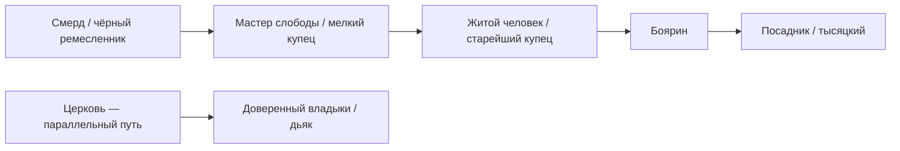

#Разработка #Сеттинг #Геймдизайн

[[00 — Обзор]] · [[Первый GDD]] · [[Карта актёра (Персонажа)]] · [[03 — Сословия и общество]]

---

## Зачем этот файл

Перевод исторической структуры [[01 — Сословная пирамида|сословий]], [[02 — Ранги и звания|рангов]] и [[03 — Должности и полномочия|должностей]] в **игровые системы** для «Вече: Новгородская Сага».

---

## Социальная лестница игрока

| Стадия GDD | Исторический ранг | Ключевой доступ |
|------------|-------------------|-----------------|
| 1 | Смерд, половник, чёрный | Слобода, община, повинности |
| 2 | Молодший купец / ремесленник | Торговля, гильдия, местный суд |
| 3 | Житой, старейший | Вече (как представитель группы), земля |
| 4 | Боярин | «Оспода», коалиции, назначения |
| 5 | Посадник / тысяцкий | Война, налоги, внешняя политика |

---

## Три оси статуса (для NPC и игрока)

1. **Сословие** — потолок прав (холоп не голосует на вече)
2. **Богатство** — торговля, взятки, брак, заклад
3. **Должность** — реальная власть поверх ранга

Пример: **богатый житой купец** может быть влиятельнее **бедного боярина**, но не станет посадником без боярского рода.

---

## Вече как игровая арена

| Исторический факт | Механика |
|-------------------|----------|
| Единогласие | Одна фракция может **заблокировать** решение |
| Кворум: должности + концы + сословия | Нужно **заранее договориться** с пятью концами |
| Бояре давят на зависимых | Экономические **крючки**: долги, заклад, аренда |
| Вече — ритуал и легитимность | Игрок может **проиграть в совете**, но выиграть на вече (или наоборот) |

---

## Конфликты сословий (сюжет и кризисы)

| Конфликт | Историческая почва | Игровой эффект |
|----------|-------------------|----------------|
| Бояре ↔ князь | Договорные ограничения | Изгнание князя, смена договора |
| Бояре ↔ купцы | Торговые пошлины, монополии | Бойкот, подкуп тысяцкого |
| Город ↔ деревня | Смерды и половники | Бунты, «Филиппово заговенье» (окно отхода) |
| Церковь ↔ свет | Десятина, меры, мораль | Суд владыки, отлучение |
| Конец ↔ конец | Пятины за концами | Голосование, гражданские столкновения |
| Элита ↔ низы | Закладники, холопы | Побег, жалоба (князю — запрещена!) |

---

## Ограничения по рангу (чеклист дизайна)

| Действие | Минимальный ранг / условие |
|----------|----------------------------|
| Голос на общегородском вече | Полноправный горожанин (не холоп) |
| Членство в Иванском сте | Старейший / принятый купец |
| Судить как сотский | Выбор от сотни |
| Вход в «осподу» | Боярин или бывший посадник/тысяцкий |
| Стать посадником | Боярин из знатного рода + поддержка совета |
| Заключать мир с Ганзой | Вече + посадник + владыка (печати) |
| Принять закладника | Боярин / житой (князь — **нет**) |

---

## Ресурсы власти (что копить игроку)

| Ресурс | Откуда | На что тратится |
|--------|--------|-----------------|
| **Конец** | Родина, староста, повинности | Голоса на вече |
| **Ста / слобода** | Ремесло, торговля | Защита, суд, цены |
| **Земля** | Покупка, брак, дар владыки | Оброк, политический вес |
| **Долги** | Ростовщичество | Зависимые закладники (и риск мятежа) |
| **Репутация** | Квесты, суды, война | Доверие фракций |
| **Грамотность** | Церковь, береста | Договоры без «скрытых пунктов» |

---

## Происхождение персонажа (старт)

| Происхождение | Стартовый ранг | Плюс | Минус |
|---------------|----------------|------|-------|
| Смерд из пятины | 9–10 | Знание земли, община | Нет города |
| Чёрный ремесленник | 7 | Слобода, навык | Повинности |
| Молодший купец | 5 | Торговля | Долги конкурентов |
| Сын священника | Церковь | Грамотность | Потолок без владыки |
| Младший сын боярина | 1 (бедный) | Имя рода | Нет земли |

Связь с идеей: [[Нужно выбирать с умом наследника]]

---

## Связь с другими механиками

- [[Экономика — количественная спецификация]] — оброк, пошлины, кормление
- [[Система слухов]] — вече и базар как усилители
- [[Карта актёра (Персонажа)]] — журнал целей NPC по сословию
- [[02 — Вече и должности]] — процедура собрания
- [[Идеи/Нужно добавить систему кризисов]] — бунты, изгнание князя, голод

---

## Открытые вопросы для прототипа

1. Показывать ли **два слоя** власти (оспода vs вече) явно в UI?
2. Сколько **концов** игрок обязан учитывать в упрощённой карте — все 5 или 3 агрегированных?
3. Церковный путь — отдельная кампания или ветка внутри одной карьеры?
4. Холоп / закладник — игровой тупик или механика **выкупа и побега**?
